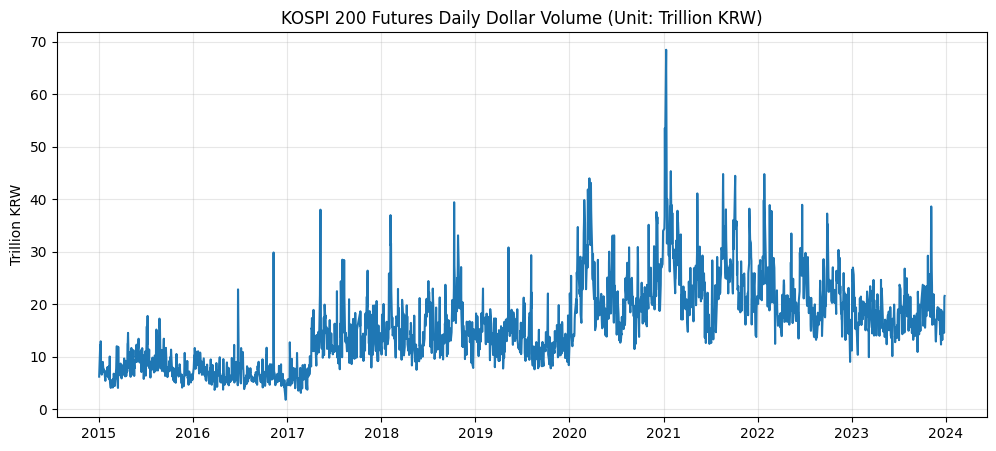
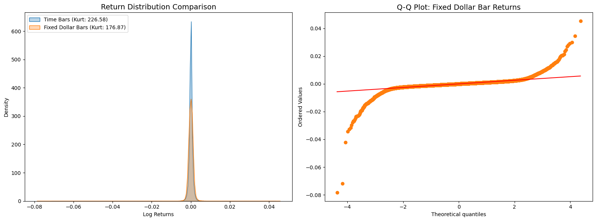

# KOSPI-CUSUM-test
Structural break detection on KOSPI 200 futures using CUSUM tests.

## 📖 Reference
- Marcos Lopez de Prado, *Advances in Financial Machine Learning*, Chapter 17 (Structural Breaks).

## Data Preprocessing Pipeline
1. **Ingestion**: Converted raw `.gz` files to ZSTD-compressed `.parquet` format, achieving an **84% reduction** in storage volume.
2. **Truncation**: Filtered for continuous trading sessions only.
   - Dynamically handles **CSAT (수능) delays** and **early openings** (post-2023-07).
   - Removes auction noise to ensure signal purity for CUSUM testing.
3. **Front-Month Identification**: Isolates liquid front-month contracts using a **volume-based proxy**. 
   - The contract with the highest daily trading volume is automatically identified as the lead month.
4. **Rollover Validation**: Implemented a sanity check to monitor daily symbol transitions.
   - Confirmed that rollovers consistently occur on the **second Friday of each quarter** (the day following expiration), ensuring a continuous and liquid time series.

## 📈 KOSPI 200 Futures: Fixed Dollar Bar Sampling & Sensitivity Analysis
This project investigates the application of Information-based sampling (Dollar Bars) to KOSPI 200 futures data.
The research focuses on how the choice of the fixed threshold ($T$) affects the statistical stationarity of returns, specifically comparing thresholds derived from historical versus global liquidity averages.

### 🔍 1. Exploratory Data Analysis (EDA): Market Regime Growth
Before sampling, we analyzed the daily dollar volume of KOSPI 200 futures from 2015 to the present.
<p align="center"></p>

**Observation:**
   - **Liquidity Regime Shift:** The KOSPI 200 market has experienced massive growth over the past decade. The dollar volume in 2026 is significantly higher than that of 2015.
   - **Implication:** A static threshold ($T$) based on early historical data may lead to sampling bias due to the structural evolution of market liquidity.

### 🧪 2. Sampling Experiments & Sensitivity Study
I conducted two experiments to find the optimal *Fixed Threshold ($T$)* following the methodology of *Marcos López de Prado.*

**Experiment A: Historical Base (The Failure)**
   - **Threshold Selection:** $T$ was calculated based on the liquidity of the first trading day (2015-01-02).
   - **Result:** -130.9% Improvement (Significant Deterioration).
   - **Analysis:** Using a 2015-based threshold resulted in extreme **oversampling** in recent years. Because current volume is much higher, bars were generated at a sub-second frequency, capturing microstructural noise instead of meaningful economic information.

**Experiment B: Global ADV Base (The Refinement)**
   - **Threshold Selection:** $T$ was calculated based on the **Global Average Daily Volume (ADV)** across the entire dataset.
   - **Result: 21.9% Reduction in Excess Kurtosis.**
   - **Analysis:** By centering $T$ on the global mean, we balanced the sampling frequency across the decade, effectively mitigating heteroscedasticity and bringing the return distribution closer to a Gaussian state.

### 📊 3. Statistical Validation
| Methodology | Excess Kurtosis | Jarque-Bera Test | Improvement |
|---|---|---|---|
| **Time Bar (5m)** | 226.58 | $3.69\times 10^8$ |   Baseline   |
| **Fixed T (2015 Base)** | 523.24 | $3.27\times 10^9$ |   -130.9% (Worsened)   |
| **Fixed T (Global ADV Base)** | **176.87** | $1.44\times 10^8$ |   **21.9% (Improved)**   |

**Visual Comparisons (Global ADV Base)**
<p align="center"></p>

   **Left (KDE):** The Fixed Dollar Bar (Orange) shows a noticeably lower peak than the
   Time Bar, indicating a reduction in the "Fat Tail" risk.
   **Right (Q-Q Plot):** The alignment with the diagonal norm improves,
   demonstrating enhanced stationarity required for robust CUSUM test.

### 🛠 4. Technical Implementation
The sampling engine is built on **Polars**, utilizing its high-performance Lazy API for tick-level processing and cumulative summation.

```Python
# Fixed Threshold Calculation
# T = Global_Average_Daily_Volume / Target_Bars_Per_Day
fixed_T = avg_dv / 50

# Global Cumulative Summation for Constant Information Units
df_dollar_bars = (
    lf.sort("timestamp")
    .with_columns([(pl.col("price") * pl.col("vol") * MULTIPLIER).alias("dv")])
    .with_columns([pl.col("dv").cum_sum().alias("cum_dv")])
    .with_columns([(pl.col("cum_dv") // fixed_T).alias("bar_idx")])
    .group_by("bar_idx")
    .agg([...])
)
```

**Researcher's Note:**
"The failure of the 2015-based threshold highlights a critical challenge in emerging markets: **regime growth.**
In markets with rapidly expanding liquidity, the definition of a 'unit of information' must reflect the global context of the dataset to avoid oversampling noise.
A 21.9% reduction in kurtosis proves that even a simple Fixed-$T$ adjustment can significantly stabilize the input for CUSUM tests."
